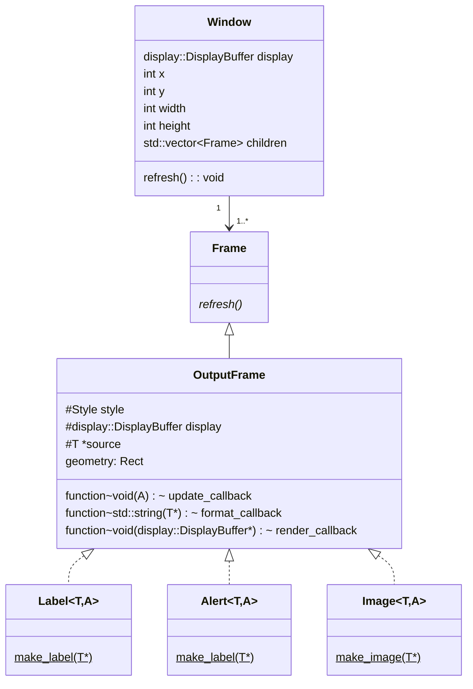

# UI Controls for Data Displays



## Design

- Incremental rendering on state change by default.
- Optional manual full refresh.
- Manipulate style of component based on entity state.
- Output components
  - Label: formatted value of a source entity that exposes `T::add_on_state_callback`.
  - Alert: on/off filled shape based on a boolean expression of a source entity that exposes `T::add_on_state_callback`.
- Input components
  - Switch: manipulates the on/off a `switch::Switch` entity.
  - Button: calls the `press()` method of a `button::Button` entity.
  - Select: manipulates the value of a `select::Select` entity.
  - Number: set the value of a `number::Number` entity.
- Special components
  - Image: render a `display::Image`provide by an `ID` or lamda.
  - Animation: render a `display::Animation` provided by an `ID` or lambda.
  - Shape: render a line, rectangle, circle, or triangle.
- Common properties
  - Geometry: x,y,w,h
  - Style: modify background color, foreground color, border color, padding, margin, font.
  - Enabled: boolean value controlling whether an input component should respond to touch events.

## Core Modifications

1. Disable auto-clear.
2. Pages are handled by the .

```c++
template<typename S, typename A>
class DynamicFrame {
  public:
   using update_callback = std::function<void(A)>;
   using format_callback = std::function<std::string(S*)>;
   using render_callback = std::function<void(display::DisplayBuffer,std::string,rect)>;

   DynamicFrame(S* source, void(S::*)(update_callback) adder) : source_(source) {
     (source->*adder)([this](A){
        this->refresh();
     });
   }

   void refresh() override
   {
      render_(display_, format_(source_), geometry_);
   }

  private:
  S* source_;
  display::DisplayBuffer display_;
  rect geometry_;
  update_callback update_;
  format_callback format_;
  render_callback render_;
};


```
