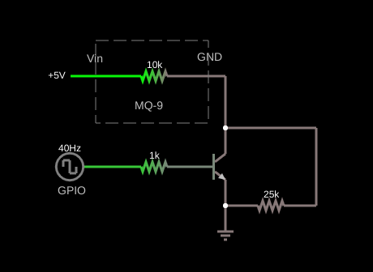
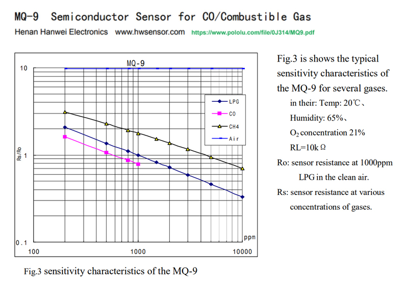

# Theory of operation:

> **Warning:** I would not consider this to be something to bet your life on.  I was annoyed by the unhelpful datasheet and after wandering aroud the internet came up with this.

The MQ-9 sensor is a "burn off" sensor.  So there aretwo periods for measurement.  One where the heater is on and one off.  This is achived with a simple circut.

## Circut:



[circutjs circut](https://lushprojects.com/circuitjs/circuitjs.html?ctz=CQAgjCAMB0l3BWcMBMcUHYMGZIA4UA2ATmIxAUgpABZsKBTAWjDACgAnEFFGkbFP0h8BUZPE7de4GiOEy+VMBIAu-bIQX8EgsLLEQYhNLjAYwKBITzFsNQ9EI1ICG4UisUrJ+WVUAJgwAZgCGAK4ANiqSGnjgxIKycWAJYpYSAEpSIrr6olRUztQFUNAIbFk8fHrV7lpUiVTY0PQlMOUA7kLVeRr1bF3YOuB1Q7qpkAPd-IJjM1BsAB7geBBgSGhKcT0gAGoAlgB2SzJIZsl4WxA7AOIACgCSAPJTcymz1vGCk8vYZuD0OzJTS3AByABE2AAjL4gFizP4gYgFE68Kg4bgYJAYEEyEAAWQAikxiK9hsRNG8UHFJoNhqI5hSFgBzbTjWbDKpiWlspEgpx8hZdGgCpki6oTKbi2FJWGTAD2YgFhUgpGKsDgGFWljSYmwbCAA)

The datasheet gives a corrilation between the Rs and R0.  R0 being our calibration point.  Rs is found using the expression below:

$\frac{Rs}{Rl} = \frac{(Vc-V_{Rl})}{V_{Rl}}$

Given that the analog voltage reading is then used as $V_{Rl}$, $Rl$ is noted at 10K, and $Vc$ is 5V we need to solve for Rs:

$Rs = \frac{Vc - V_{Rl}}{V_{Rl}} * 10000$

The actual concentration would end up being:

$ppm = \frac{Rs}{R0}$


## Calibration:

The datasheet provided unhelpfully provides a low resolution diagram of the response.  To extract some useful data from it use <https://apps.automeris.io/wpd> to modify [calibration data](calibration.json). If you feel you can do better give it a whirl.



The image at first glance looks to have straight lines.  So the $y=mx+b$ seems to be a great fit. $\frac{Rs}{R0}$ would be Y and ppm would be X. Unhelpfully it is in a $\frac{log_{10}}{log_{10}}$ scale so it needs to be processed before calculation.  To update the calibration parameters run `calibration.py` to refresh `calibration.h`.  This will give a slope that can be followed to calculate ppm.

Once these values are calculated it can be used to convert to the ppm values:

$ppm = 10^\frac{log_{10}\frac{Rs}{R0} - b}{m}$


## Notes on CO:

| PPM     | Typical                                      |
|---------|----------------------------------------------|
| 0.1     | Outside rural area                           |
| 0.5 - 5 | Typical indoor level, or outside urban areas |
| 5 - 15  | Within feet of a gas stove or furnace        |
| 15 - 20 | Typical concentration of furnace vent        |
| 35      | EPA maximum outdoor level                    |
| 50      | Maximum save level for 8 hours               |
| 150     | Polluted city centers                        |
| 400     | Enclosed space with car                      |
| 1,500   | Close to fire                                |
| 6,400   | Undiluted car exhaust                        |

## Notes on TVOC:

| PPB         | Typical   |
|-------------|-----------|
| 0 - 65      | Excellent |
| 65 - 220    | Good      |
| 220 - 660   | Moderate  |
| 660 - 2200  | Poor      |
| 2200 - 5500 | Unhealthy |


# Usage in ESPHome

Match `AD` to the MQ-9 A0 and `GPIO` to the control in schematic above.  `r0` can be provided or set to `0` in which case a niave attempt will be made to calibrate it based on 30 seconds of `burn off` readings.

```yaml
external_components:
  - source:
      type: git
      url: https://gitlab.com/geiseri/esphome_extras.git
    refresh: 0s

sensor:
  - platform: mq9_circut
    control_pin: GPIO
    adc_pin: AD
    r0: 0
    tvoc:
      name: "TVOC"
    carbon_monoxide:
      name: "CO"
```
